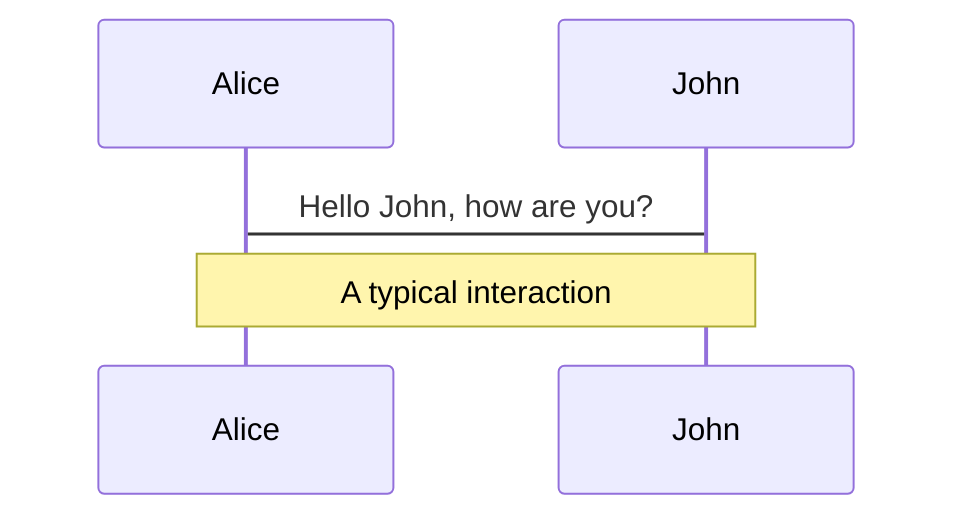
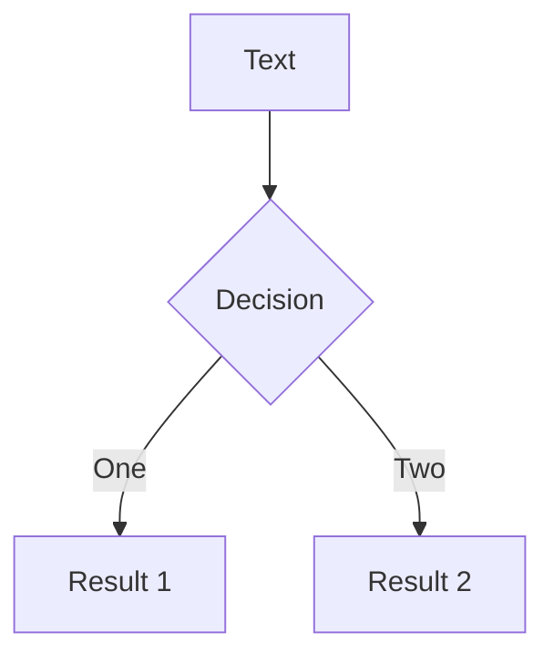
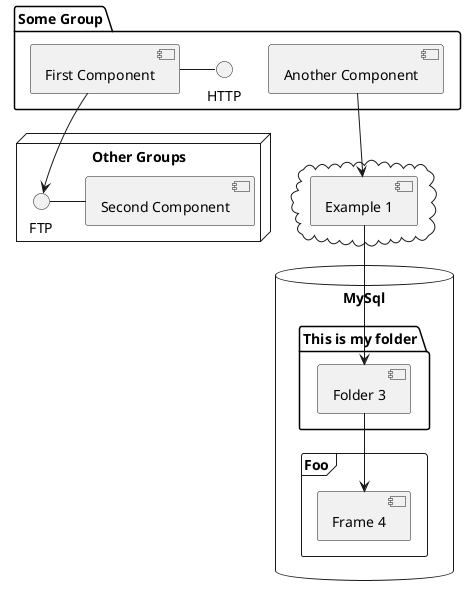

# La Pollution

Presentation sur la Pollution SVT

<div class="pt-12">
  <span @click="$slidev.nav.next" class="px-2 py-1 rounded cursor-pointer" hover="bg-white bg-opacity-10">
    Introduction Générale <carbon:arrow-right class="inline"/>
  </span>
</div>


---
preload: false
transition: slide-left
---

# C'est Quoi La Pollution En Général?

<br/>

En général, la pollution désigne l'introduction dans l'environnement de substances ou d'énergies qui ont un impact négatif sur la qualité de l'environnement et la santé des êtres vivants. Cela peut inclure la pollution de l'air, de l'eau, du sol, des sons, ainsi que la pollution lumineuse, thermique, électromagnétique, etc. Les sources de pollution peuvent être naturelles ou causées par les activités humaines. Les impacts peuvent varier, allant de la simple détérioration de la qualité de vie à des conséquences graves pour la santé et l'environnement.

<style>
* {
  text-align: center;
}

h1 {
  background-color: #4EC5D4;
  background-clip: text;
}
  
p {
  background-color: #FFFFFFFF;
  background-clip: text;
  font-size: 150%;
}
</style>


---
preload: false
transition: slide-up
---

# Les Types De Pollution

Il existe différents types de pollution, notamment:

<div>
    <ol>
        <li>
            <span class="px-1 py-1 rounded cursor-pointer" hover="bg-white bg-opacity-14">
                Pollution de l'air: causée par les émissions de gaz à effet de serre, les particules en suspension, les oxydes d'azote, les composés organiques volatils, etc.
            </span>
        </li>
        <br/>
        <li>
            <span class="px-1 py-1 rounded cursor-pointer" hover="bg-white bg-opacity-14">
                Pollution de l'eau: causée par la contamination des sources d'eau par des produits chimiques, des déchets industriels et municipaux, des pesticides, des métaux lourds, etc.
            </span>
        </li>
        <br/>
        <li>
            <span class="px-1 py-1 rounded cursor-pointer" hover="bg-white bg-opacity-14">
                Pollution du sol: causée par la contamination des sols par des produits chimiques, des déchets industriels et municipaux, des métaux lourds, etc.
            </span>
        </li>
        <br/>
        <li>
            <span class="px-1 py-1 rounded cursor-pointer" hover="bg-white bg-opacity-14">
              Pollution de radioactivité: causée par les activités nucléaires, les mines d'uranium, les déchets radioactifs, etc.
            </span>
        </li>
    </ol>
</div>

Ces sont quelques exemples de types de pollution, mais il en existe d'autres, chacun ayant des impacts différents sur l'environnement et la santé des êtres vivants.


---
preload: false
transition: slide-left
layout: image-right
image: /pollution-left.jpg
---
# Pollution de L'Air

<br/>

La pollution de l'air est la présence de substances dans l'atmosphère qui sont nuisibles pour la santé humaine et l'environnement. Elle peut être causée par des activités humaines telles que la combustion de combustibles pour la production d'énergie, les industries, les transports, l'agriculture, ainsi que par des phénomènes naturels comme les éruptions volcaniques et les incendies de forêt.

<style>
* {
  text-align: center;
}

h1 {
  background-color: #4EC5D4;
  background-clip: text;
}
  
p {
  background-color: #FFFFFFFF;
  background-clip: text;
  font-size: 150%;
}
</style>

---
preload: false
transition: slide-left
layout: image-left
image: /pollution-right.jpg
---

Les principales substances nocives dans la pollution de l'air comprennent les gaz à effet de serre, les particules en suspension, les oxydes d'azote, les composés organiques volatils et les métaux lourds. Les effets de la pollution de l'air peuvent inclure des maladies respiratoires et cardiaques, un accroissement du risque de cancer, ainsi qu'une réduction de la qualité de vie et des impacts négatifs sur l'environnement.

<style>
* {
  text-align: center;
}

h1 {
  background-color: #4EC5D4;
  background-clip: text;
}
  
p {
  background-color: #FFFFFFFF;
  background-clip: text;
  font-size: 150%;
}
</style>

---
class: px-20
---

# Themes

Slidev comes with powerful theming support. Themes can provide styles, layouts, components, or even configurations for tools. Switching between themes by just **one edit** in your frontmatter:

<div grid="~ cols-2 gap-2" m="-t-2">

```yaml
---
theme: default
---
```

```yaml
---
theme: seriph
---
```


</div>

Read more about [How to use a theme](https://sli.dev/themes/use.html) and
check out the [Awesome Themes Gallery](https://sli.dev/themes/gallery.html).

---
preload: false
---

# Animations

Animations are powered by [@vueuse/motion](https://motion.vueuse.org/).

```html
<div
  v-motion
  :initial="{ x: -80 }"
  :enter="{ x: 0 }">
  Slidev
</div>
```

<div class="w-60 relative mt-6">
  <div class="relative w-40 h-40">
    
    
    
  </div>

  <div
    class="text-5xl absolute top-14 left-40 text-[#2B90B6] -z-1"
    v-motion
    :initial="{ x: -80, opacity: 0}"
    :enter="{ x: 0, opacity: 1, transition: { delay: 2000, duration: 1000 } }">
    Slidev
  </div>
</div>

<!-- vue script setup scripts can be directly used in markdown, and will only affects current page -->
<script setup lang="ts">
const final = {
  x: 0,
  y: 0,
  rotate: 0,
  scale: 1,
  transition: {
    type: 'spring',
    damping: 10,
    stiffness: 20,
    mass: 2
  }
}
</script>

<div
  v-motion
  :initial="{ x:35, y: 40, opacity: 0}"
  :enter="{ y: 0, opacity: 1, transition: { delay: 3500 } }">

[Learn More](https://sli.dev/guide/animations.html#motion)

</div>

---

# LaTeX

LaTeX is supported out-of-box powered by [KaTeX](https://katex.org/).

<br>

Inline $\sqrt{3x-1}+(1+x)^2$

Block
$$
\begin{array}{c}

\nabla \times \vec{\mathbf{B}} -\, \frac1c\, \frac{\partial\vec{\mathbf{E}}}{\partial t} &
= \frac{4\pi}{c}\vec{\mathbf{j}}    \nabla \cdot \vec{\mathbf{E}} & = 4 \pi \rho \\

\nabla \times \vec{\mathbf{E}}\, +\, \frac1c\, \frac{\partial\vec{\mathbf{B}}}{\partial t} & = \vec{\mathbf{0}} \\

\nabla \cdot \vec{\mathbf{B}} & = 0

\end{array}
$$

<br>

[Learn more](https://sli.dev/guide/syntax#latex)

---

# Diagrams

You can create diagrams / graphs from textual descriptions, directly in your Markdown.

<div class="grid grid-cols-3 gap-10 pt-4 -mb-6">







</div>

[Learn More](https://sli.dev/guide/syntax.html#diagrams)

---
src: ./pages/multiple-entries.md
hide: false
---

---
layout: center
class: text-center
---

# Learn More

[Documentations](https://sli.dev) · [GitHub](https://github.com/slidevjs/slidev) · [Showcases](https://sli.dev/showcases.html)
